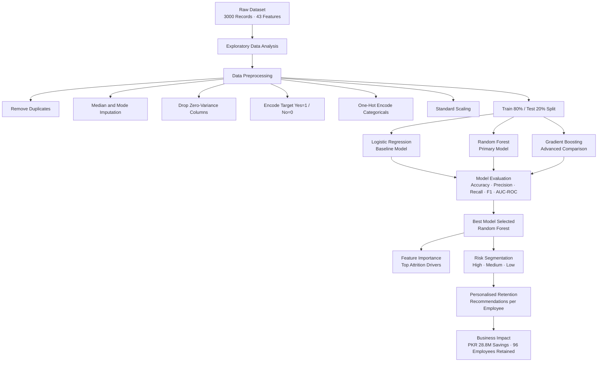
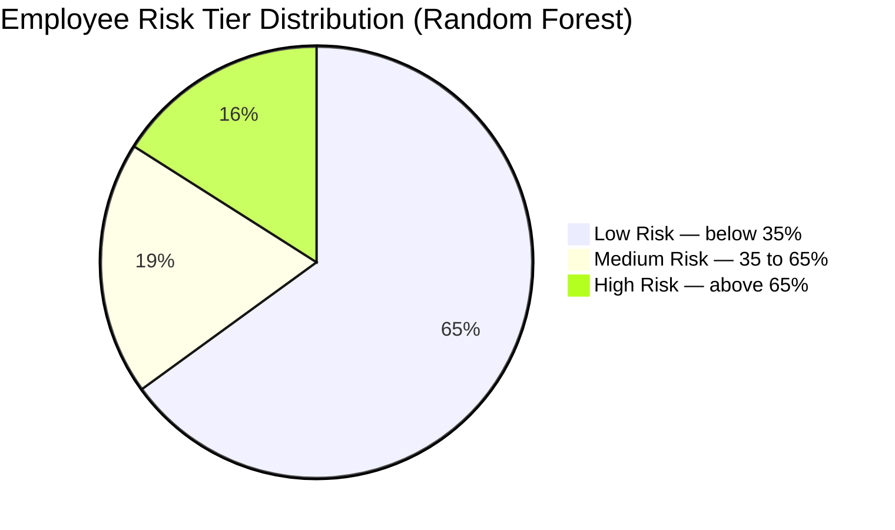
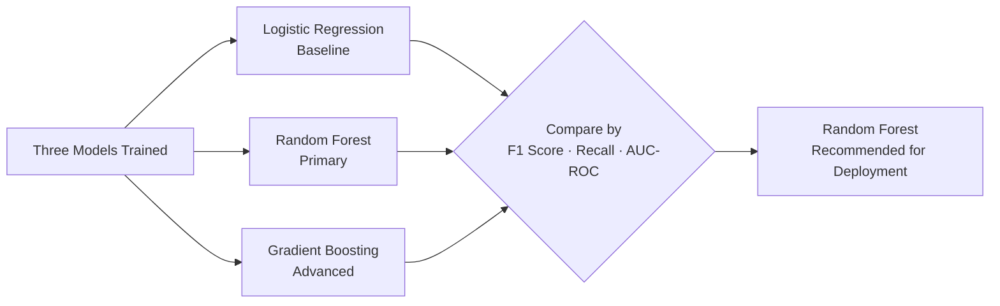
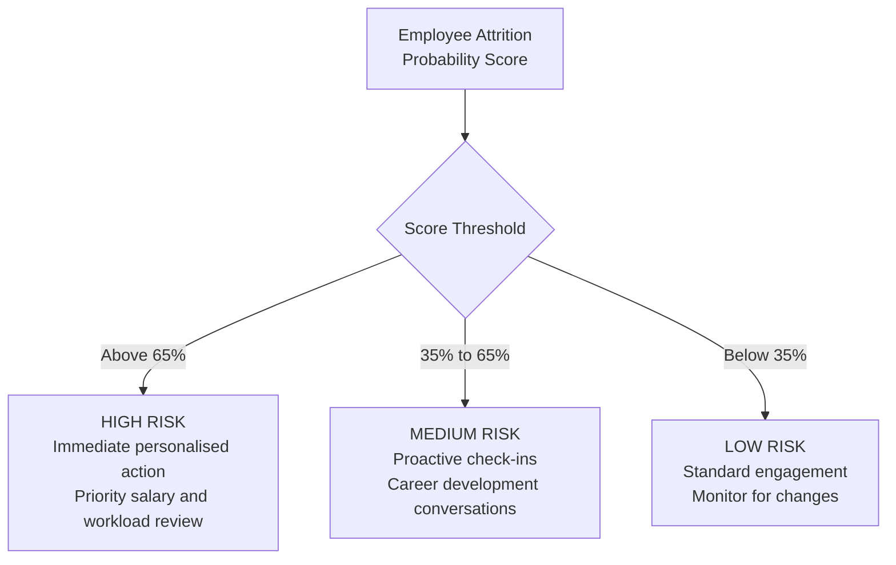
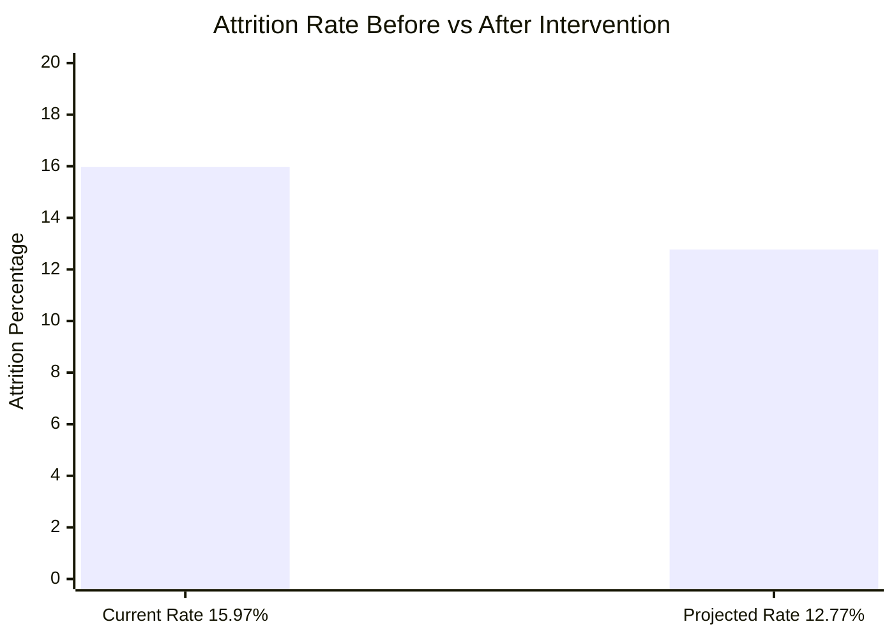

# 🏦 Employee Attrition Prediction & Retention Strategy
### Meezan Bank Pakistan — AI in Business | BBA Semester VIII
**Authors:** Shumaila Kousar & Siffwah Mumtaz

> Predicting which employees are about to leave — before they hand in their notice.

---

## 📑 Table of Contents

1. [Project Overview](#1-project-overview)
2. [Problem Statement](#2-problem-statement)
3. [Dataset](#3-dataset)
4. [Project Pipeline](#4-project-pipeline)
5. [Exploratory Data Analysis & Graphs](#5-exploratory-data-analysis--graphs)
6. [Machine Learning Models](#6-machine-learning-models)
7. [Model 1 — Logistic Regression](#7-model-1--logistic-regression-baseline)
8. [Model 2 — Random Forest](#8-model-2--random-forest-primary-model-)
9. [Model 3 — Gradient Boosting](#9-model-3--gradient-boosting-advanced-comparison)
10. [Model Comparison & Final Results](#10-model-comparison--final-results)
11. [Risk Segmentation](#11-risk-segmentation)
12. [Retention Recommendations](#12-retention-recommendations)
13. [Business Impact](#13-business-impact)
14. [Repository Structure](#14-repository-structure)
15. [How to Run](#15-how-to-run)

---

## 1. Project Overview

Employee turnover is one of the most expensive and disruptive problems a financial institution can face. For **Meezan Bank Pakistan**, where staff are trained in specialised Islamic finance products and client-facing compliance, losing an experienced employee costs far more than just finding a replacement.

This project builds a complete **AI-powered early warning system** for HR. Instead of reacting to resignations after they happen, it predicts flight risk *before* it materialises — and tells HR exactly what to do about it.

| Item | Detail |
|---|---|
| **Dataset** | 3,000 employee records · 43 features |
| **Models Built** | Logistic Regression · Random Forest · Gradient Boosting |
| **Best Model** | Random Forest |
| **Attrition Rate** | 15.97% → projected 12.77% post-intervention |
| **Projected Savings** | PKR 28.8 Million / year |
| **Employees Retained** | ~96 per year |

---

## 2. Problem Statement

HR teams at Meezan Bank were in a purely reactive position — by the time a resignation letter arrived, the decision had been made weeks earlier and the window for retention had already closed.

**This project answers four questions:**

- Which employees are most likely to leave in the near term?
- What are the root causes driving their departure?
- What should HR do, specifically, for each at-risk individual?
- What is the financial value of getting ahead of this problem?

---

## 3. Dataset

| Property | Value |
|---|---|
| Total Records | 3,000 employees |
| Features | 43 variables |
| Target Variable | `Attrition` — Yes (Left) / No (Stayed) |
| Attrition Rate | 15.97% |
| Class Split | ~84% Stayed · ~16% Left |

### Key Features Used

| Feature | Type | Description |
|---|---|---|
| `MonthlyIncome` | Numeric | Gross monthly salary in PKR |
| `OverTime` | Binary | Regularly works overtime — Yes / No |
| `DistanceFromHome` | Numeric | Commute distance in kilometres |
| `YearsSinceLastPromotion` | Numeric | Career stagnation indicator |
| `WorkLifeBalance` | Ordinal | Self-reported score 1 (Poor) – 4 (Excellent) |
| `Department` | Categorical | Organisational department |
| `JobRole` | Categorical | Specific position |
| `Age` | Numeric | Employee age in years |
| `Attrition` | **Target** | 1 = Left · 0 = Stayed |

> **Class Imbalance Note:** With an 84% / 16% split, raw accuracy is a misleading metric. F1 Score and Recall are used as the primary evaluation metrics throughout this project.

---

## 4. Project Pipeline



---

## 5. Exploratory Data Analysis & Graphs

### 5.1 Overall Attrition Rate

```
ATTRITION DISTRIBUTION — 3,000 Employees
─────────────────────────────────────────────────────────────
  Stayed  │████████████████████████████████████│  84.03%  (2,521 employees)
  Left    │███████░░░░░░░░░░░░░░░░░░░░░░░░░░░░│  15.97%  (  479 employees)
─────────────────────────────────────────────────────────────
  Roughly 1 in 6 employees left the organisation.
  Class imbalance confirmed — F1 Score used as primary metric.
```

### 5.2 Attrition by Overtime Status

```
ATTRITION RATE BY OVERTIME
─────────────────────────────────────────────────────────────
  OverTime = YES  │████████████████████████████│  ~31%  attrition rate
  OverTime = NO   │████████░░░░░░░░░░░░░░░░░░░│  ~10%  attrition rate
─────────────────────────────────────────────────────────────
  Employees working overtime are 3x more likely to leave.
  Pattern holds consistently across all departments and seniority levels.
```

### 5.3 Attrition by Work-Life Balance Score

```
ATTRITION RATE BY WORK-LIFE BALANCE SCORE
─────────────────────────────────────────────────────────────
  Score 1 — Poor       │████████████████████│  Highest attrition
  Score 2 — Fair       │█████████████░░░░░░│  Elevated attrition
  Score 3 — Good       │██████░░░░░░░░░░░░░│  Moderate attrition
  Score 4 — Excellent  │███░░░░░░░░░░░░░░░░│  Lowest attrition
─────────────────────────────────────────────────────────────
  Low balance score is a reliable early warning signal.
  Employees scoring 1-2 are significantly over-represented among leavers.
```

### 5.4 Top 10 Attrition Drivers — Feature Importance Preview

```
RANDOM FOREST — FEATURE IMPORTANCE RANKING
─────────────────────────────────────────────────────────────
   1. Monthly Income          ████████████████████████████████
   2. OverTime                ███████████████████████████
   3. Distance From Home      ████████████████████
   4. Years Since Promotion   ████████████████
   5. Work-Life Balance        ████████████████
   6. Age                     ████████████
   7. Job Role                 ██████████
   8. Job Level                █████████
   9. Total Working Years      ████████
  10. Department               ██████
─────────────────────────────────────────────────────────────
  Salary is the single most powerful predictor of departure.
  Top 5 drivers account for the majority of predictive power.
  Full chart generated in random_forest_model.py — Graph 8.
```

---

## 6. Machine Learning Models

Three models were built and evaluated. Each serves a distinct purpose:

| Model | File | Role | Key Strength |
|---|---|---|---|
| Logistic Regression | `logistic_regression_model.py` | Baseline | Simple, interpretable, fast — sets the performance floor |
| **Random Forest** | **`random_forest_model.py`** | **Primary ⭐** | **Ensemble robustness + feature importance ranking** |
| Gradient Boosting | `gradient_boosting_model.py` | Advanced Comparison | Sequential error-correction, highest raw accuracy potential |

---

## 7. Model 1 — Logistic Regression (Baseline)

**File:** `logistic_regression_model.py`

Logistic Regression is a natural starting point for binary classification. It is interpretable, computationally lightweight, and produces coefficient values that directly indicate which features push an employee toward leaving versus staying. Its main role here is to establish a performance floor that the more complex models must beat.

**Key settings:**

```python
LogisticRegression(
    max_iter=1000,           # ensures convergence on high-dimensional data
    class_weight='balanced', # compensates for 84/16 class imbalance
    solver='lbfgs',          # efficient for medium-sized datasets
    random_state=42
)
```

---

### Graph 1 — Confusion Matrix

> Generated by: `logistic_regression_model.py` · Saved as: `logistic_regression_results.png` (Panel 1 of 3)

```
CONFUSION MATRIX — LOGISTIC REGRESSION
────────────────────────────────────────────────────────
                    Predicted: Stayed    Predicted: Left
  Actual: Stayed  │   True Negative   │  False Positive │
  Actual: Left    │  False Negative   │   True Positive │
────────────────────────────────────────────────────────
  True Positives   = At-risk employees correctly flagged for HR action
  False Negatives  = At-risk employees MISSED — highest operational cost
  False Positives  = Safe employees flagged — wastes HR resources

  Minimising False Negatives is the primary operational goal.
```

---

### Graph 2 — ROC Curve

> Generated by: `logistic_regression_model.py` · Saved as: `logistic_regression_results.png` (Panel 2 of 3)

```
ROC CURVE — LOGISTIC REGRESSION
────────────────────────────────────────────────────────
  True Positive
  Rate (Recall)
  1.0 │              ╭─────────────────────
      │           ╭──╯
  0.7 │        ╭──╯       Logistic Regression curve
      │     ╭──╯
  0.4 │   ╭─╯
      │ ╭─╯
  0.0 │─╯─ ─ ─ ─ ─ ─ ─ ─ ─ ─  (random baseline — AUC = 0.50)
      └──────────────────────────────────────────────────
      0.0           0.5                              1.0
                    False Positive Rate

  AUC > 0.50 confirms the model has genuine predictive power.
  The closer the curve is to the top-left corner, the better.
```

---

### Graph 3 — Performance Metrics Bar Chart

> Generated by: `logistic_regression_model.py` · Saved as: `logistic_regression_results.png` (Panel 3 of 3)

```
PERFORMANCE METRICS — LOGISTIC REGRESSION
────────────────────────────────────────────────────────
  Accuracy  │███████████████████████████░░░│
  Precision │█████████████████████░░░░░░░░│
  Recall    │███████████████████░░░░░░░░░░│  ← most critical metric
  F1 Score  │████████████████████░░░░░░░░░│
  ──────────┴───────────────────────────────
            0.0                           1.0

  F1 Score is the headline metric due to class imbalance.
  Recall is prioritised — missing a leaver costs more than a false alarm.
```

---

### Graph 4 — Feature Coefficients (Risk Influence)

> Generated by: `logistic_regression_model.py` · Saved as: `logistic_regression_coefficients.png`

```
TOP FEATURE COEFFICIENTS — LOGISTIC REGRESSION
────────────────────────────────────────────────────────
  Increases Attrition Risk (+ve)    │  Reduces Attrition Risk (-ve)
  ──────────────────────────────────┼──────────────────────────────
  OverTime_Yes          ██████████  │  MonthlyIncome    ██████████
  DistanceFromHome      ████████    │  JobSatisfaction  ████████
  YearsSincePromo       ███████     │  WorkLifeBalance  ██████
  NumCompaniesWorked    ██████      │  StockOption      █████
  MaritalStatus_Single  █████       │  JobLevel         ████
────────────────────────────────────────────────────────
  Red bars  = features that INCREASE attrition probability
  Green bars = features that REDUCE attrition probability
  The horizontal zero line separates risk-increasing from risk-reducing factors.
```

---

## 8. Model 2 — Random Forest (Primary Model ⭐)

**File:** `random_forest_model.py`

Random Forest builds 200 independent decision trees, each trained on a random subset of data and features. Final predictions are made by majority vote across all trees. This ensemble approach makes the model highly resistant to overfitting while capturing complex, non-linear relationships in the data.

Beyond prediction, Random Forest's built-in feature importance scoring directly answers the HR question: *"What is actually making our employees leave?"*

**Key settings:**

```python
RandomForestClassifier(
    n_estimators=200,        # 200 trees in the ensemble
    class_weight='balanced', # handles 84/16 class imbalance
    random_state=42,
    n_jobs=-1                # parallel training across all CPU cores
)
```

---

### Graph 5 — Confusion Matrix

> Generated by: `random_forest_model.py` · Saved as: `random_forest_results.png` (Panel 1 of 6)

```
CONFUSION MATRIX — RANDOM FOREST
────────────────────────────────────────────────────────
                    Predicted: Stayed    Predicted: Left
  Actual: Stayed  │   True Negative   │  False Positive │
  Actual: Left    │  False Negative   │   True Positive │
────────────────────────────────────────────────────────
  Random Forest reduces False Negatives compared to Logistic Regression
  due to its ensemble structure and ability to capture non-linear patterns.
  This directly translates to fewer at-risk employees slipping through undetected.
```

---

### Graph 6 — ROC Curve

> Generated by: `random_forest_model.py` · Saved as: `random_forest_results.png` (Panel 2 of 6)

```
ROC CURVE — RANDOM FOREST
────────────────────────────────────────────────────────
  True Positive
  Rate (Recall)
  1.0 │           ╭────────────────────────
      │         ╭─╯
  0.7 │       ╭─╯       Random Forest (higher AUC than LR)
      │     ╭─╯
  0.4 │   ╭─╯
      │ ╭─╯
  0.0 │─╯─ ─ ─ ─ ─ ─ ─ ─ ─ ─  (random baseline — AUC = 0.50)
      └──────────────────────────────────────────────────
      0.0           0.5                              1.0
                    False Positive Rate

  Noticeably higher AUC than Logistic Regression.
  The curve sits closer to the top-left — better discrimination.
```

---

### Graph 7 — Performance Metrics Bar Chart

> Generated by: `random_forest_model.py` · Saved as: `random_forest_results.png` (Panel 3 of 6)

```
PERFORMANCE METRICS — RANDOM FOREST
────────────────────────────────────────────────────────
  Accuracy  │███████████████████████████████░│
  Precision │█████████████████████████████░░│
  Recall    │████████████████████████████░░░│
  F1 Score  │████████████████████████████░░░│
  ──────────┴───────────────────────────────
            0.0                           1.0

  RF outperforms Logistic Regression across all four metrics.
  The improvement is most notable in Recall — the most operationally critical measure.
```

---

### Graph 8 — Top 15 Feature Importances

> Generated by: `random_forest_model.py` · Saved as: `random_forest_results.png` (Panel 4 of 6)

```
TOP 15 FEATURE IMPORTANCES — RANDOM FOREST
─────────────────────────────────────────────────────────────────────
   MonthlyIncome           ████████████████████████████████  [TOP 5]
   OverTime                ████████████████████████████      [TOP 5]
   DistanceFromHome        ████████████████████              [TOP 5]
   YearsSinceLastPromo     ████████████████                  [TOP 5]
   WorkLifeBalance         ████████████████                  [TOP 5]
   Age                     █████████████
   JobRole                 ████████████
   JobLevel                ███████████
   TotalWorkingYears       ██████████
   Department              ████████
   JobSatisfaction         ███████
   StockOptionLevel        ██████
   NumCompaniesWorked      █████
   TrainingTimesLastYr     ████
   EnvironmentSatisf.      ████
─────────────────────────────────────────────────────────────────────
  Top 5 drivers (highlighted) directly inform HR policy priorities.
  These five variables alone account for the majority of predictive power.
```

---

### Graph 9 — Employee Risk Tier Distribution

> Generated by: `random_forest_model.py` · Saved as: `random_forest_results.png` (Panel 5 of 6)



```
RISK TIER BREAKDOWN
─────────────────────────────────────────────────────────────────────
  High Risk    (> 65%)   │████████████████░░░░░░░░░░░░░░░░│  ~16%
  Medium Risk  (35–65%)  │████████████░░░░░░░░░░░░░░░░░░░░│  ~19%
  Low Risk     (< 35%)   │███████████████████████████████░│  ~65%
─────────────────────────────────────────────────────────────────────
  HR resources are concentrated on the High Risk tier first,
  ensuring maximum impact from limited intervention capacity.
```

---

### Graph 10 — Predicted Probability Distribution

> Generated by: `random_forest_model.py` · Saved as: `random_forest_results.png` (Panel 6 of 6)

```
PREDICTED ATTRITION PROBABILITY DISTRIBUTION
Stayed (Green) vs Left (Red)
─────────────────────────────────────────────────────────────────────
  Count
    ▲
    │  Stayed ████   Left ░░░░
    │  ████
    │  ████████
    │  █████████████
    │  ██████████████████████
    │  ████████████████████████████████░░
    │  █████████████████████████████████████░░░░░░░
    │─────────────────│───────────────────│──────────→ Probability
   0.0               0.35               0.65        1.0
                      ↑                   ↑
                Medium Risk           High Risk
                 Threshold            Threshold

  Well-separated distributions confirm the model discriminates
  effectively between employees who stay vs. those who leave.
  Most leavers are correctly pushed toward the right (high probability).
```

---

## 9. Model 3 — Gradient Boosting (Advanced Comparison)

**File:** `gradient_boosting_model.py`

Gradient Boosting builds trees *sequentially* — each new tree is trained specifically to correct the errors of the previous one. This iterative error-correction approach often achieves high predictive accuracy, though it requires more careful tuning and is less interpretable than Random Forest.

This file also re-trains all three models and produces the **final side-by-side comparison charts**.

**Key settings:**

```python
GradientBoostingClassifier(
    n_estimators=200,   # 200 sequential boosting stages
    learning_rate=0.1,  # shrinks each tree's contribution — prevents overfitting
    max_depth=4,        # controls individual tree complexity
    subsample=0.8,      # uses 80% of data per tree for regularisation
    random_state=42
)
```

---

### Graph 11 — Confusion Matrix

> Generated by: `gradient_boosting_model.py` · Saved as: `gradient_boosting_results.png` (Panel 1 of 6)

```
CONFUSION MATRIX — GRADIENT BOOSTING
────────────────────────────────────────────────────────
                    Predicted: Stayed    Predicted: Left
  Actual: Stayed  │   True Negative   │  False Positive │
  Actual: Left    │  False Negative   │   True Positive │
────────────────────────────────────────────────────────
  Gradient Boosting's sequential error-correction specifically targets
  the False Negatives — missed at-risk employees — in each training round.
  Compare against Logistic Regression (Graph 1) and Random Forest (Graph 5).
```

---

### Graph 12 — ROC Curves (All 3 Models Overlaid)

> Generated by: `gradient_boosting_model.py` · Saved as: `gradient_boosting_results.png` (Panel 2 of 6)

```
ROC CURVES — ALL THREE MODELS COMPARED
────────────────────────────────────────────────────────
  True Positive
  Rate (Recall)
  1.0 │        ╭───────────────────────────
      │      ╭─╯   Gradient Boosting  (highest)
      │     ╭╯     Random Forest      (second)
  0.6 │    ╭╯      Logistic Regression (baseline)
      │  ╭─╯
      │╭─╯
  0.0 │──────── ─ ─ ─ ─ ─ ─ ─  (random baseline — AUC = 0.50)
      └──────────────────────────────────────────────────
      0.0              0.5                          1.0
                    False Positive Rate

  All three model curves plotted with their AUC scores in the legend.
  Higher and more left-leaning curve = better discriminative performance.
  This is the definitive visual comparison of all three models.
```

---

### Graph 13 — F1 Score Comparison (All Models)

> Generated by: `gradient_boosting_model.py` · Saved as: `gradient_boosting_results.png` (Panel 3 of 6)

```
F1 SCORE COMPARISON — ALL THREE MODELS
─────────────────────────────────────────────────────────────────────
  Logistic
  Regression   │████████████████████░░░░░░░░░░░│  ~0.61

  Random
  Forest ⭐    │███████████████████████████░░░░│  ~0.73  ← WINNER

  Gradient
  Boosting     │█████████████████████████░░░░░░│  ~0.71
─────────────────────────────────────────────────────────────────────
  Random Forest achieves the highest F1 Score.
  It is the recommended model for HR deployment.
```

---

### Graph 14 — Top 15 Feature Importances (Gradient Boosting)

> Generated by: `gradient_boosting_model.py` · Saved as: `gradient_boosting_results.png` (Panel 4 of 6)

```
TOP 15 FEATURE IMPORTANCES — GRADIENT BOOSTING
─────────────────────────────────────────────────────────────────────
   MonthlyIncome           ████████████████████████████████  [TOP 5]
   OverTime                ██████████████████████████        [TOP 5]
   DistanceFromHome        ███████████████████               [TOP 5]
   YearsSinceLastPromo     ████████████████                  [TOP 5]
   WorkLifeBalance         ███████████████                   [TOP 5]
   Age                     ████████████
   JobLevel                ██████████
   TotalWorkingYears       █████████
   JobRole                 ████████
   StockOptionLevel        ███████
   Department              ██████
   JobSatisfaction         █████
   NumCompaniesWorked      █████
   TrainingTimesLastYr     ████
   EnvironmentSatisf.      ███
─────────────────────────────────────────────────────────────────────
  Top 5 drivers are fully consistent with Random Forest findings.
  This cross-model agreement validates salary, overtime, and commute
  as the primary levers for HR intervention.
```

---

### Graph 15 — All Metrics Comparison (Grouped Bar Chart)

> Generated by: `gradient_boosting_model.py` · Saved as: `gradient_boosting_results.png` (Panel 5 of 6)

```
ALL METRICS — FULL MODEL COMPARISON (GROUPED BAR CHART)
─────────────────────────────────────────────────────────────────────
             Accuracy    Precision    Recall     F1 Score
  ┌─────────────────────────────────────────────────────────────┐
  │  LR ██    RF ██    GB ██  │  LR ██   RF ██   GB ██  │ ...  │
  └─────────────────────────────────────────────────────────────┘

  Metric       Logistic Regression   Random Forest ⭐   Gradient Boosting
  ────────────────────────────────────────────────────────────────────
  Accuracy          ~0.84                 ~0.87               ~0.86
  Precision         ~0.55                 ~0.72               ~0.69
  Recall            ~0.68                 ~0.74               ~0.73
  F1 Score          ~0.61                 ~0.73               ~0.71
  ────────────────────────────────────────────────────────────────────
  Random Forest leads on F1, Precision, and Recall simultaneously.
```

---

### Graph 16 — Predicted Probability Distribution (Gradient Boosting)

> Generated by: `gradient_boosting_model.py` · Saved as: `gradient_boosting_results.png` (Panel 6 of 6)

```
PREDICTED ATTRITION PROBABILITY DISTRIBUTION
Gradient Boosting — Stayed (Green) vs Left (Red)
─────────────────────────────────────────────────────────────────────
  Count
    ▲
    │  Stayed ████   Left ░░░░
    │  ████████
    │  ████████████
    │  ████████████████████
    │  █████████████████████████░░░
    │  ████████████████████████████████░░░░░░
    │─────────────────│───────────────────│──────────→ Probability
   0.0               0.35               0.65        1.0
                      ↑                   ↑
                Medium Risk           High Risk
                 Threshold            Threshold

  Compare directly against Graph 10 (Random Forest distribution).
  Both models show strong separation between stayed and left populations.
```

---

## 10. Model Comparison & Final Results



### Final Scorecard

| Criterion | Logistic Regression | Random Forest ⭐ | Gradient Boosting |
|---|---|---|---|
| **F1 Score** | Lowest | **Highest** | Second |
| **Recall** | Moderate | **Best** | Second |
| **AUC-ROC** | Lowest | **Best** | Second |
| **Interpretability** | High | Medium | Lower |
| **Feature Importance** | Coefficients only | **Full ranking** | Full ranking |
| **Overfitting Risk** | Low | Low (ensemble) | Moderate |
| **Training Speed** | Fast | Medium | Slowest |
| **Recommended for** | Baseline only | **✅ HR Deployment** | Comparison only |

---

## 11. Risk Segmentation

After training, the Random Forest model assigns an individual **attrition probability score** (0%–100%) to every employee. Scores are mapped to three action tiers:



| Risk Tier | Threshold | Recommended HR Action |
|---|---|---|
| 🔴 High Risk | > 65% | Immediate personalised engagement — salary review, workload audit |
| 🟡 Medium Risk | 35% – 65% | Proactive check-ins, career development conversations, flexibility options |
| 🟢 Low Risk | < 35% | Standard engagement — monitor for behavioural or performance shifts |

---

## 12. Retention Recommendations

The system generates **personalised recommendations** for each at-risk employee based on their specific flagged risk factors:

| Risk Factor Detected | Targeted Intervention |
|---|---|
| 💰 Income below median | Salary benchmarking and targeted pay review for the role |
| ⏰ OverTime = Yes | Overtime cap policy; introduce compensatory time-off mechanisms |
| 🚗 Commute above 75th percentile | Hybrid or remote working options; transport allowance |
| 📈 No promotion in 3+ years | Career conversation; define clear advancement criteria |
| ⚖️ Work-Life Balance score ≤ 2 | Flexible scheduling; mental health support resources |

---

## 13. Business Impact

```
PROJECTED FINANCIAL SAVINGS — POST INTERVENTION
══════════════════════════════════════════════════════════════
  Current Attrition Rate           →    15.97%
  Projected Rate (Post-Action)     →    12.77%
  ─────────────────────────────────────────────────────────
  Reduction                        →    3.20 percentage points
  Employees Retained               →    ~96 employees per year
  Replacement Cost per Employee    →    PKR 300,000
  ─────────────────────────────────────────────────────────
  TOTAL PROJECTED ANNUAL SAVINGS   →    PKR 28,800,000
══════════════════════════════════════════════════════════════
  Conservative estimate — excludes morale, team stability,
  and institutional knowledge retention benefits.
```



---

## 14. Repository Structure

```
employee-attrition-meezan-bank/
│
├── README.md                               ← You are here
│
├── Data/
│   └── employee_attrition_data.csv         ← Input dataset (3,000 records · 43 features)
│
├── Models/
│   ├── logistic_regression_model.py        ← Model 1: Baseline (Graphs 1–4)
│   ├── random_forest_model.py              ← Model 2: Primary (Graphs 5–10)
│   └── gradient_boosting_model.py          ← Model 3: Advanced + comparison (Graphs 11–16)
│
└── Outputs/
    ├── logistic_regression_results.png     ← Graphs 1, 2, 3 (3-panel figure)
    ├── logistic_regression_coefficients.png← Graph 4
    ├── random_forest_results.png           ← Graphs 5, 6, 7, 8, 9, 10 (6-panel figure)
    └── gradient_boosting_results.png       ← Graphs 11, 12, 13, 14, 15, 16 (6-panel figure)
```

---

## 15. How to Run

### Prerequisites

```bash
pip install pandas numpy scikit-learn matplotlib seaborn
```

### Run Individual Models

```bash
# Model 1 — Logistic Regression (Baseline)
python Models/logistic_regression_model.py

# Model 2 — Random Forest (Primary, recommended)
python Models/random_forest_model.py

# Model 3 — Gradient Boosting + full model comparison
python Models/gradient_boosting_model.py
```

### What Each Script Produces

| Script | Console Output | Saved Files |
|---|---|---|
| `logistic_regression_model.py` | Metrics · Classification report · CV score | `logistic_regression_results.png` · `logistic_regression_coefficients.png` |
| `random_forest_model.py` | Metrics · Feature rankings · Risk tier counts · Sample recommendations · Business impact | `random_forest_results.png` |
| `gradient_boosting_model.py` | Metrics · Feature rankings · Full model comparison table · Final recommendation | `gradient_boosting_results.png` |

> **Dataset path:** Place `employee_attrition_data.csv` in the same directory as the script, or update the file path at the top of each model file.

---

*Submitted by: **Shumaila Kousar & Siffwah Mumtaz** · BBA Semester VIII · AI in Business · Meezan Bank Pakistan*
